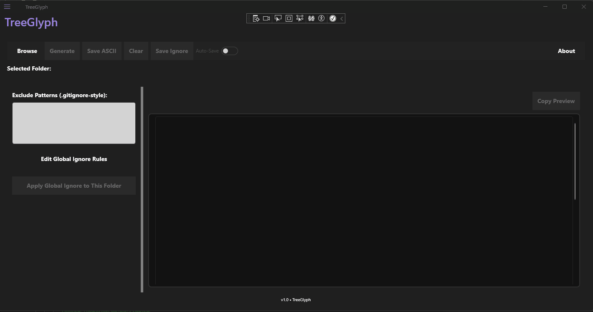
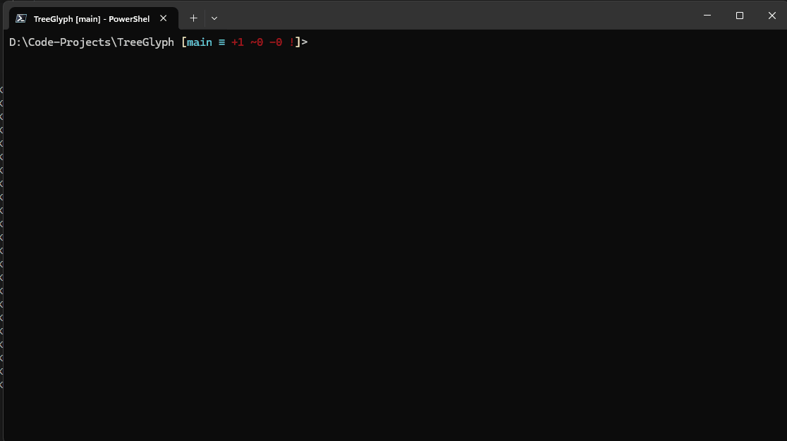

# 🌲 TreeGlyph

**TreeGlyph** is a fast, user-friendly utility for visualizing folder structures — with both a native .NET MAUI desktop UI and a powerful CLI tool. Exclude folders using `.treeglyphignore`, copy trees to clipboard, save as text, or just enjoy the visual clarity.

---

## 🖥️ Desktop UI Preview

Explore and inspect directories with a responsive, desktop-native interface:



---

## 🧮 Command Line Output

Render nested folder structures in your terminal with clean ASCII formatting:



```bash
treeglyph src bin,obj,node_modules --depth 2 --clipboard


TreeGlyph CLI

📦 Installer
TreeGlyph comes with a Windows installer that lets you:
- Choose install location
- Automatically add TreeGlyph to your system PATH
- Add Start Menu shortcuts
TreeGlyph Installer

🚀 Installation
- Download TreeGlyphSetup.exe from Releases
- Run the installer — accept default or choose custom path
- Launch via Start Menu or open terminal and type:
treeglyph


You can also use dotnet tool install --global treeglyph if published to NuGet.


🔧 CLI Options
| Option | Description | 
| --depth [n] | Limit nesting depth | 
| --save [path] | Save output to a file | 
| --clipboard | Copy output to clipboard | 
| --noglobal | Skip applying global ignore rules | 
| --setglobal [r] | Overwrite global ignore file (comma-separated rules) | 
| --editglobal | Open global ignore file in text editor | 
| --help | Show command line help | 


📁 Ignore Rules
- .treeglyphignore in the target folder
- ignore-global.txt stored in %AppData%\TreeGlyph
- Inline exclusions passed via CLI:
treeglyph src bin,obj,temp --noglobal


📘 License
MIT License
© Kenneth Stanley
